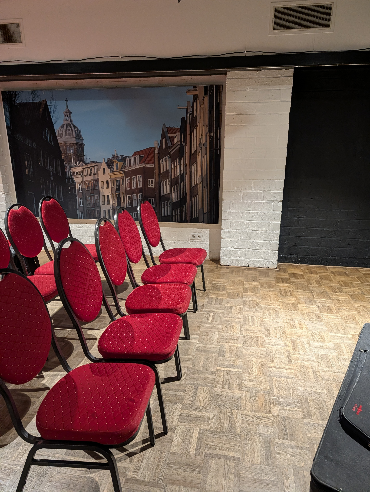
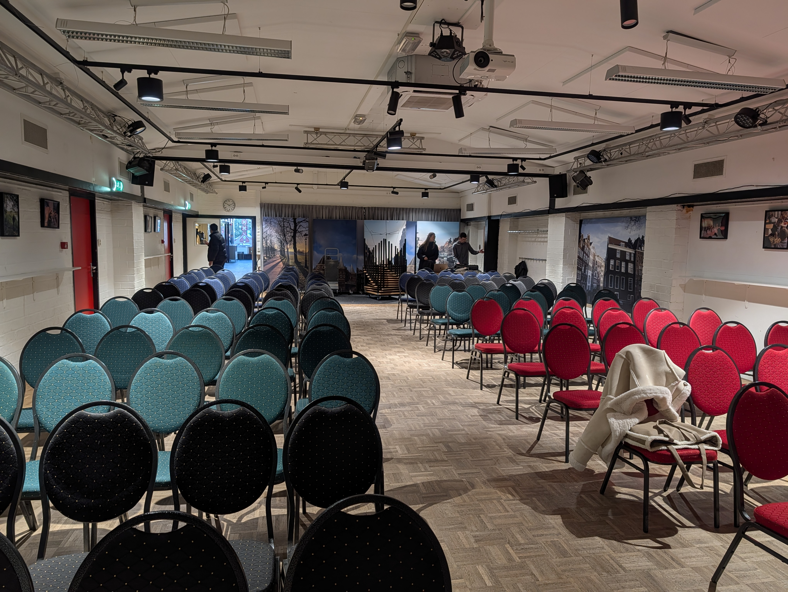
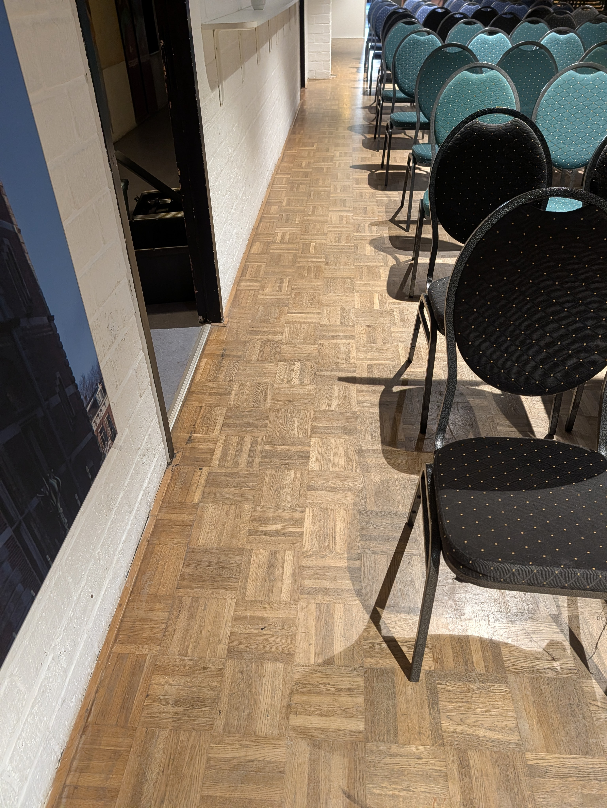
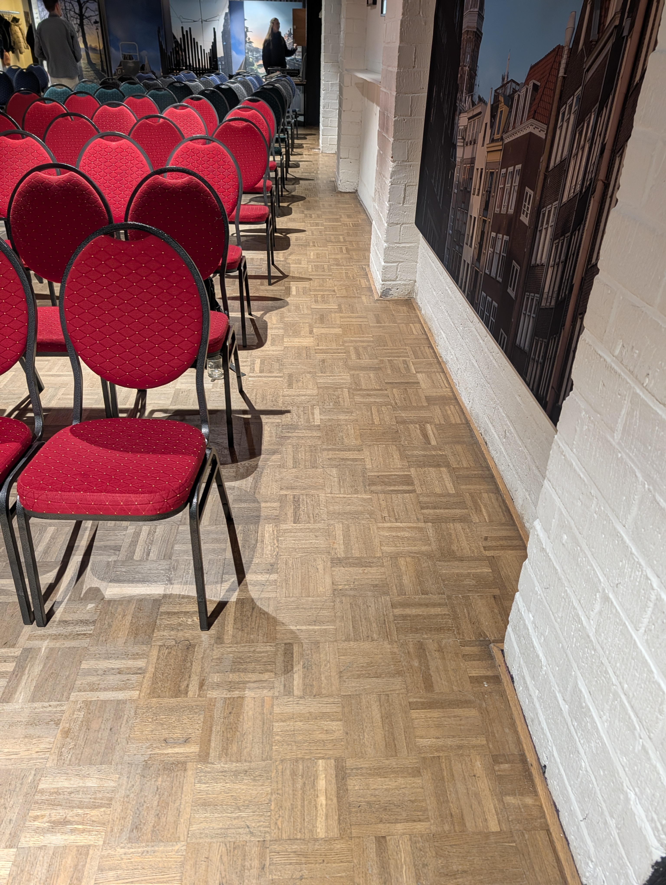
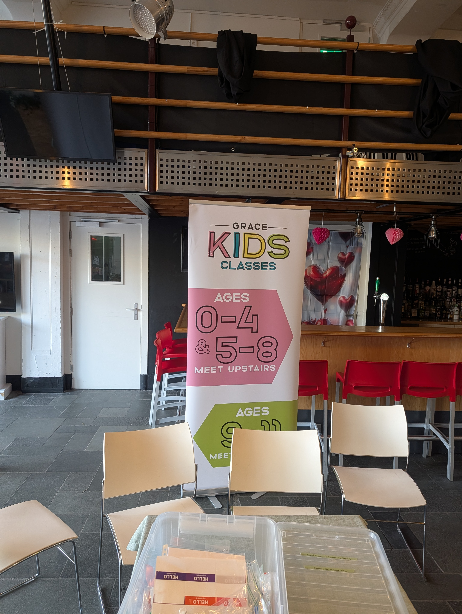
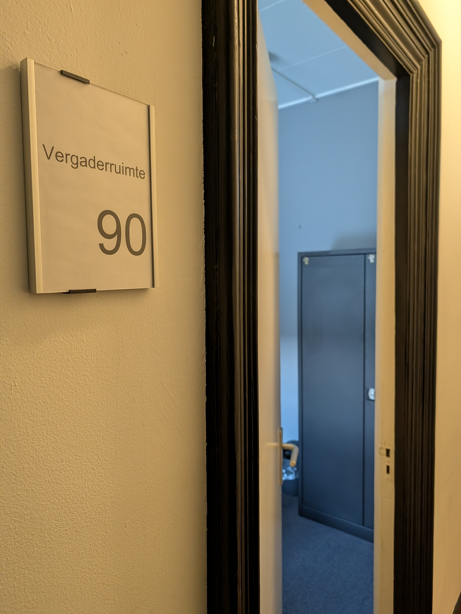
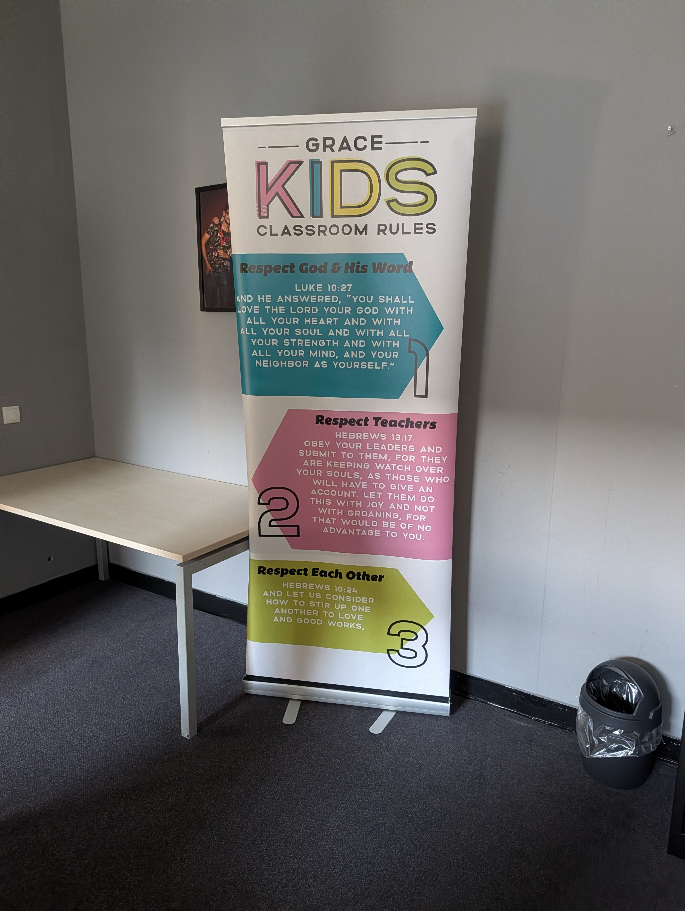

# Normal Day Setup
If this is the first week of the month, then see *# Family Sunday Setup*

## Chairs
- Found in the small room near the stage. Go over to the side of the stage and unlock the lock from inside.
- Start from first pillar 
  
- 5 chairs on each side of the aisle 
  
- For people with prams, use only 4 chairs per aisle in the last 2 rows
- There should be 3 floor squares between the legs of chairs in each row
- Leave around 4 floor squares gap with the wall for accessibility
  
  

## Banners 
- All banners are found in the store room
    - You will find the keys in a small box near the door. The code is **0316**
- Place the church sign outside the door 
- Welcome sign near the entrance 
  
- Kids class banner near the entrance to floor above (near the bar area) 
  
  - There is a kids class banner for _Family Sunday_. Make sure you are NOT using that banner
- Class rules in the kids class on first floor, room 90.
  
  

# Tear Down
- Make sure to lock the store room door or coordinate with others who are using it
- Stack 10 chairs per stack and with same color and place in the small room.
    - Try to arrange the chairs in the similar order as they were found in the small room.
- Latch the small room door from inside.

---- 

# Family Sunday Setup
1st week of the month is Family Sunday
Few modifications to the Normal Day Setup is required

## Chairs
- 6 chairs on each side of the aisle (since kids will be at church)
- Don't need the classroom rules banner

## Banners 
- Use the Family Sunday banner instead of the regular kids class banner.
